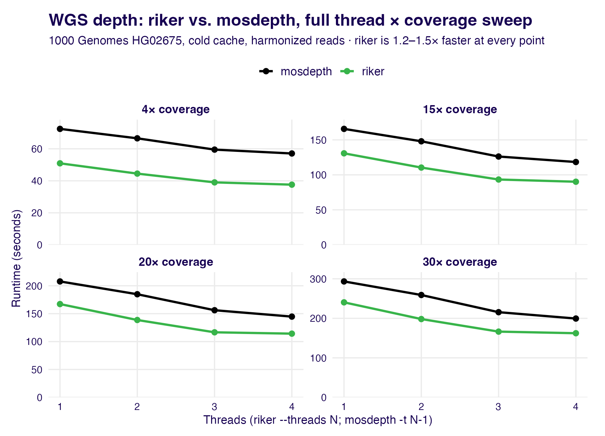
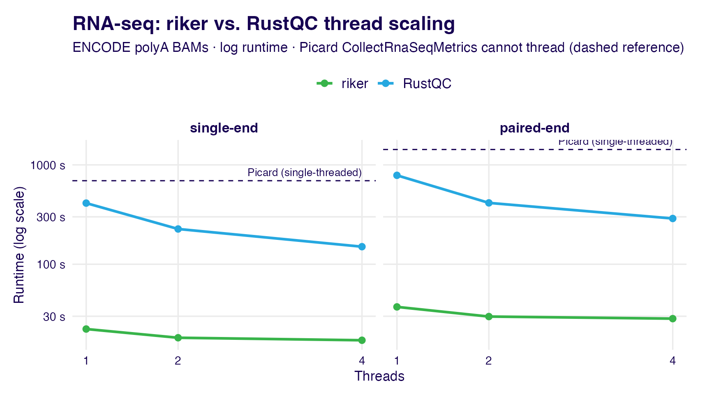
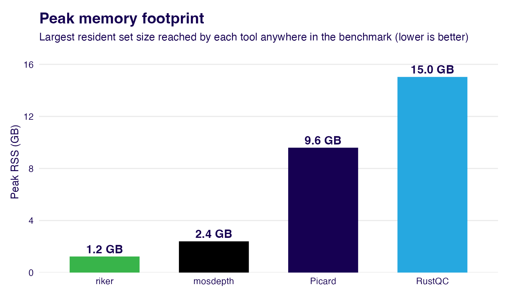

# riker benchmark-pipeline

Reproducible Snakemake pipeline that benchmarks **riker** against
**Picard**, **mosdepth**, and **RustQC** on real public WGS, exome, and
RNA-seq data. It runs end-to-end on a fresh AWS EC2 instance (or any
clean Linux box) with public-internet access only.

The numbers in the top-level [README's Performance
section](../README.md#performance) come from this pipeline. This document
is the full methodology and the complete result tables behind them.

## The 2026-07-06 run

Every number below is from a single run on one host:

- **Instance:** AWS `m8a.2xlarge` — 8 vCPU AMD EPYC 9R45, 32 GB RAM.
- **Storage:** 400 GB gp3 EBS root volume, throughput dialed to 
  **1000 MiB/s** (with 4000 IOPS.
- **OS:** Ubuntu 24.04 (glibc 2.39) (in order to satisfy RustQC's 
  `GLIBC_2.38` requirement)
- **Tool versions:** riker 0.4.0 (built from source exactly the say the bioconda recipe does it),
  Picard 3.4.0 on OpenJDK 25.0.2, mosdepth 0.3.14, RustQC 0.2.1,
  samtools 1.23.1 — every comparator from bioconda.
- **Scale:** 92 timed cells, 1 replicate each, ≈13 hours of serialized
  timed work — budget an overnight run. ~172 GB of staged BAMs plus
  references and the GENCODE annotation.

### Cold cache — every measurement

Every timed cell drops the OS page cache immediately before the tool runs:

```bash
sync; echo 3 | sudo tee /proc/sys/vm/drop_caches
```

so each tool reads its inputs cold from disk. This is deterministic and
uniform across the coverage ladder. Without it, a 13 GB BAM that happens
to fit in 32 GB of RAM stays cached between serialized runs and hands the
next tool run an edge that a compute-bound tool never sees. Warming instead
can't cache the 37–41 GB 30× BAMs, so cold is the only size-uniform,
production-representative choice.

### Harmonized read/base selection

For the WGS depth comparison the three tools are configured to count the
**same reads and bases** (to the degree possible), so the wall times are
apples-to-apples:

- **MAPQ ≥ 20** — riker/Picard default; mosdepth `-Q 20`.
- **Orphan / unpaired mates counted** — riker `--include-unpaired-reads`,
  Picard `COUNT_UNPAIRED=true`, mosdepth by default.
- **Duplicate, secondary, and supplementary alignments excluded** —
  mosdepth `-F 3332` matches riker's whole-read filters.
- **mosdepth in accurate mode** — no `-x` fast-mode (which skips the CIGAR
  walk and mate-overlap de-duplication) and no `-a`; it walks CIGARs and
  corrects mate overlaps the way riker and Picard do.
- **The one asymmetry:** riker and Picard filter on base quality (BQ ≥ 20);
  mosdepth has no switch for it. So in every WGS cell below, riker is doing
  strictly *more* per-base work than mosdepth.

## Results

### WGS depth — riker vs. Picard CollectWgsMetrics vs. mosdepth

Single thread, harmonized, cold cache. `BAM` is the on-disk size after
CRAM→BAM transcoding; wall times are `m:ss`.

| Sample | Cov | BAM | riker | Picard CWM | mosdepth | vs. Picard | vs. mosdepth |
|---|---|---|---|---|---|---|---|
| HG02675 | 4×  | 7.1 GB  | 0:51 | 10:13 | 1:12 | **12.0×** | **1.42×** |
| HG02675 | 15× | 21.7 GB | 2:11 | 26:55 | 2:46 | **12.3×** | **1.27×** |
| HG02675 | 20× | 28.1 GB | 2:47 | 34:14 | 3:28 | **12.3×** | **1.24×** |
| HG00188 | 30× | 37.5 GB | 3:46 | 48:43 | 4:31 | **12.9×** | **1.20×** |
| HG02675 | 30× | 41.1 GB | 4:00 | 51:12 | 4:53 | **12.8×** | **1.22×** |

Picard `CollectWgsMetrics` is single-threaded, so it appears at one thread
only. riker and mosdepth both thread; across the full 1–4 thread sweep
riker stays ahead of mosdepth at every point, by 1.2–1.5× (widest at low
coverage, where riker's compute lead isn't yet amortized against I/O):



The 30× thread sweep (HG02675) in numbers — riker `--threads N` against
mosdepth `-t (N-1)`, since mosdepth's `-t` counts *extra* decompression
threads on top of its main thread:

| Threads | riker | mosdepth | vs. mosdepth |
|---|---|---|---|
| 1 | 4:00 | 4:53 | **1.22×** |
| 2 | 3:18 | 4:19 | **1.31×** |
| 3 | 2:46 | 3:36 | **1.30×** |
| 4 | 2:42 | 3:19 | **1.23×** |

### WGS — riker `multi` vs. the Picard bundle

`riker multi --tools wgs alignment basic isize gcbias` computes WGS depth
plus alignment, insert-size, base-quality, and GC-bias metrics in one pass
over the BAM (4 threads). The Picard equivalent is `CollectMultipleMetrics`
(with `CollectGcBiasMetrics`) *plus* `CollectWgsMetrics`, run as two
separate single-threaded invocations — each re-reading the data.

| Sample | Cov | riker `multi` (4t) | Picard (CMM + CWM) | Speedup |
|---|---|---|---|---|
| HG02675 | 4×  | 0:45 | 17:18 (7:09 + 10:08)     | **23.3×** |
| HG02675 | 15× | 1:47 | 48:11 (21:31 + 26:40)    | **27.0×** |
| HG02675 | 20× | 2:18 | 1:01:55 (27:58 + 33:57)  | **26.9×** |
| HG00188 | 30× | 3:05 | 1:27:14 (38:27 + 48:47)  | **28.3×** |
| HG02675 | 30× | 3:15 | 1:30:33 (40:16 + 50:17)  | **27.9×** |

### Exome capture — riker vs. Picard CollectHsMetrics

GIAB Ashkenazi trio, Agilent SureSelect Human All Exon V5, single thread.
The bundle columns are `riker multi --tools hybcap alignment basic isize`
(4 threads) vs. Picard `CollectMultipleMetrics` + `CollectHsMetrics`.

| Sample | BAM | riker `hybcap` | Picard CHsM | Speedup | riker `multi` | Picard bundle | Speedup |
|---|---|---|---|---|---|---|---|
| HG002 | 10.3 GB | 0:56 | 12:10 | **13.1×** | 0:40 | 19:04 (6:42 + 12:22) | **28.3×** |
| HG003 | 9.0 GB  | 0:48 | 10:54 | **13.6×** | 0:35 | 16:22 (5:46 + 10:35) | **28.0×** |
| HG004 | 10.2 GB | 0:55 | 11:35 | **12.7×** | 0:39 | 18:13 (6:33 + 11:40) | **27.7×** |

mosdepth `--by targets.bed` also runs against this profile (~1:25–1:35),
but it only computes per-target coverage, not the full hybrid-selection
metrics riker and Picard produce, so it isn't a like-for-like comparator —
it's a coverage-only reference point.

### RNA-seq — riker vs. Picard CollectRnaSeqMetrics vs. RustQC

Two ENCODE polyA BAMs. Picard `CollectRnaSeqMetrics` is single-threaded
(one-thread column only); riker and RustQC sweep 1/2/4 threads.

| Sample | Layout | BAM | Reads | riker | Picard CRSM | RustQC | vs. Picard | vs. RustQC |
|---|---|---|---|---|---|---|---|---|
| ENCFF028IUE | single-end | 2.7 GB | 31.4 M | 0:22 | 11:33 | 6:52 | **31×** | **18.5×** |
| ENCFF482AEE | paired-end | 4.2 GB | 54.7 M | 0:37 | 23:47 | 13:04 | **38×** | **21.1×** |

RustQC threads well, but riker stays several-fold ahead across the sweep —
even at four threads RustQC trails riker by ~9–10×. Picard can't thread at
all (dashed line):



| Sample | Threads | riker | RustQC | vs. RustQC |
|---|---|---|---|---|
| ENCFF028IUE (SE) | 1 | 0:22 | 6:52 | **18.5×** |
| ENCFF028IUE (SE) | 2 | 0:18 | 3:46 | **12.4×** |
| ENCFF028IUE (SE) | 4 | 0:17 | 2:30 | **8.7×** |
| ENCFF482AEE (PE) | 1 | 0:37 | 13:04 | **21.1×** |
| ENCFF482AEE (PE) | 2 | 0:30 | 6:54 | **13.9×** |
| ENCFF482AEE (PE) | 4 | 0:28 | 4:49 | **10.2×** |

### Memory

riker's peak resident set stays at or below ~1.2 GB across every workload.
Picard's JVM and RustQC's RNA pipeline are far heavier: Picard
`CollectRnaSeqMetrics` peaks at 9.6 GB and RustQC at 15 GB — both on the
same RNA BAMs where riker uses 1.2 GB.



Per-tool peak RSS also appears as a column in `bench.tsv` for every cell,
so the full breakdown (e.g. Picard `CollectWgsMetrics` scaling from 1.6 GB
at 4× to 4.2 GB at 30×) is available there.

### Reproducing these figures

The three figures above are written by
[`workflow/scripts/plot_benchmark_figures.R`](workflow/scripts/plot_benchmark_figures.R)
from a `bench_summary.tsv`; the top-level README's headline charts come
from the sibling `plot_readme_figures.R`. Both read the pipeline's own
output — regenerate with, e.g.:

```bash
Rscript benchmark-pipeline/workflow/scripts/plot_benchmark_figures.R \
    benchmark-pipeline/results/bench_summary.tsv benchmark-pipeline/docs/images
```

## Profiles & comparators

Each riker invocation is paired with its fair comparators. `-t{N}` in a
profile name encodes the thread budget.

| Profile | riker | Picard | mosdepth | RustQC |
|---|---|---|---|---|
| `wgs-t1`…`wgs-t4` | `riker wgs --include-unpaired-reads` (`--threads N`) | `CollectWgsMetrics` (`t1` only) | accurate + harmonized (`-Q 20 -F 3332 --no-per-base`, `-t (N-1)`) | — |
| `wgs-bundle` | `riker multi --tools wgs alignment basic isize gcbias` (4t) | `CollectMultipleMetrics` (+`GcBias`) + `CollectWgsMetrics` | — | — |
| `hybcap-only` | `riker hybcap` (1t) | `CollectHsMetrics` | `--by targets.bed` (coverage only) | — |
| `hybcap-bundle` | `riker multi --tools hybcap alignment basic isize` (4t) | `CollectMultipleMetrics` + `CollectHsMetrics` | — | — |
| `rna-t1`/`-t2`/`-t4` | `riker rna` (`--threads N`) | `CollectRnaSeqMetrics` (`t1` only) | — | `rustqc rna` scope-matched subset (`--threads N`) |

**Threading.** WGS and RNA sweep 1–4 and 1/2/4 threads respectively;
single-threaded comparators (Picard `CollectWgsMetrics` /
`CollectRnaSeqMetrics`) appear only in the `t1` profile of each sweep. The
bundle profiles run riker at 4 threads; Picard `CollectMultipleMetrics`
gets `samjdk.async_io_*=true` JVM properties to be at least somewhat fair
against that, while the supplementary Picard runs (`CollectWgsMetrics`,
`CollectHsMetrics`) and the exome `hybcap-only` tools stay single-threaded.

**RustQC scope-matching.** RustQC runs ~15 RNA-QC modules in one pass;
[`config/rustqc.rna.subset.yaml`](config/rustqc.rna.subset.yaml) disables
the ones riker has no analog for (dupRadar, preseq, read-duplication,
junction saturation, the samtools passthroughs) so the two do comparable
work. It runs with `-Q 0` (RustQC defaults to MAPQ ≥ 30, which would
process fewer reads than riker) and `-s <strand>` / `--paired` to match
riker's read selection. Both riker and RustQC are measured as their
projects ship them — riker's multivers `dist` build vs. RustQC's bioconda
build.

**Qualimap** is implemented in `workflow/rules/run_qualimap.smk` but not
enabled in the default `COMPARATORS` matrix: it OOMs on 30× WGS at both
16 GB and 24 GB heap on a 32 GB host even with a retry loop. Re-add
`("qualimap", "main")` entries to `COMPARATORS` to bring it back on a
larger box.

## Data (locked picks, no per-run randomness)

**WGS** — NYGC 30× CRAMs picked by file-size percentile across the 2,504
samples in the public 1000 Genomes 30× bucket, plus a downsample series
anchored on the median-size sample. `select_nygc.py` is documentation-only:
it made the picks once; they are now baked into `config/samples.wgs.tsv`.

| Sample | Source | Staged BAM | Notes |
|---|---|---|---|
| `HG00188_30x` | `s3://1000genomes/…/ERR3240174/HG00188.final.cram` | 37.5 GB | small (5th pct by CRAM size) |
| `HG02675_30x` | `s3://1000genomes/…/ERR3242389/HG02675.final.cram` | 41.1 GB | medium (50th pct); downsample anchor |
| `HG02675_20x` | downsampled from `HG02675_30x` | 28.1 GB | seed = 1 |
| `HG02675_15x` | downsampled from `HG02675_30x` | 21.7 GB | seed = 2 |
| `HG02675_4x`  | downsampled from `HG02675_30x` | 7.1 GB | seed = 3, smoke fixture |
| `HG04131_30x` | `s3://1000genomes/…/ERR3243060/HG04131.final.cram` | ~52 GB | large (95th pct); **disabled by default** in `samples.wgs.tsv` (re-enable on hosts with ≥400 GB scratch) |

The depth series uses `samtools view --subsample <frac> --subsample-seed <N>`
with explicit seeds (1, 2, 3 — recorded in `config/samples.wgs.tsv`) so the
downsamples are deterministic.

**Capture** — GIAB Ashkenazi trio with the Oslo University Hospital
Agilent SureSelect Human All Exon V5 prep:

| Sample | Source | Staged BAM |
|---|---|---|
| `HG002_av5` | GIAB FTP / Oslo / Agilent v5 | 10.3 GB |
| `HG003_av5` | GIAB FTP / Oslo / Agilent v5 | 9.0 GB |
| `HG004_av5` | GIAB FTP / Oslo / Agilent v5 | 10.2 GB |

Agilent v5 is from 2015, but it's the only GIAB-trio exome dataset that
fits the 5–15 GB BAM-size target. The schema accepts more kits/samples
without code changes — extend `config/samples.hybcap.tsv` and
`config/kits.yaml`. `config/samples.hybcap.tsv` declares
`reference: grch37_b37` for these rows; verify after first staging that the
BAMs are b37 (no `chr` prefix), not hs37d5:

```bash
samtools view -H stage/HG002_av5/input.bam | grep '^@SQ' | head -3
```

If they turn out to be hs37d5, point the `grch37_b37` entry's `fasta_url`
in `config/references.yaml` at hs37d5 and re-run staging.

**RNA** — two ENCODE polyA RNA-seq BAMs (GRCh38, STAR-aligned), one
single-end and one paired-end, exercising both strand modes:

| Sample | Source | Layout | Strand | Staged BAM |
|---|---|---|---|---|
| `ENCFF028IUE` | ENCODE (K562) | single-end | forward | 2.7 GB |
| `ENCFF482AEE` | ENCODE (immune, ENCSR039JPA) | paired-end | unstranded | 4.2 GB |

Fetched via `encodeproject.org/@@download` and used **as-is** — no
markdup/fixmate: they're already coordinate-sorted (all three tools need
that), the RustQC subset drops dupRadar (its only marked-dup consumer), and
`riker rna` falls back to its non-MC insert-size path. No genome FASTA is
staged — `riker rna`, `CollectRnaSeqMetrics`, and `rustqc rna` on BAM input
don't need one.

The gene model is **GENCODE** (release pinned in
[`config/annotations.yaml`](config/annotations.yaml), currently v50).
`riker rna` and `rustqc` read the GTF directly; staging derives a Picard
`refFlat` (via UCSC `gtfToGenePred`) and a per-sample rRNA `interval_list`
(the GTF's rRNA/Mt_rRNA loci under the BAM's `@SQ` header) for
`CollectRnaSeqMetrics` — one annotation source, three tools. (The ENCODE
BAMs were aligned against GENCODE v29; since this is a performance-only
benchmark, QC'ing against a newer annotation doesn't change the work each
tool does.) Extend [`config/samples.rna.tsv`](config/samples.rna.tsv) to
add samples.

## Running the pipeline

### Pre-`./install.sh` checklist (fresh EC2 / Linux box)

These steps aren't done by `install.sh` itself:

1. **Use Ubuntu 22.04+/24.04, not Amazon Linux 2023.** RustQC's bioconda
   binary needs `GLIBC_2.38`; AL2023 ships glibc 2.34 and `rustqc` won't
   load. Any glibc ≥ 2.38 distro works. (Drop `rustqc` from `COMPARATORS`
   if you must run on an older glibc — the rest of the pipeline is fine.)

2. **Provision fast scratch storage** and point `stage_dir` at it. riker is
   now fast enough that storage bandwidth, not decode, can bound the WGS
   runs, so the staging volume needs high *sustained* throughput:

   - **Provisioned gp3 EBS (recommended; required on the `m8a`-class hosts,
     which have no instance store).** Attach a gp3 volume and dial its
     throughput to the **1000 MiB/s** ceiling (4000 IOPS). Serialized timed
     runs (`bench=100`, one at a time) keep EBS variance out of the numbers,
     and gp3 lets you buy throughput without oversizing the instance.
   - **Local NVMe instance store** (`c5d` / `i4i` / `m6id`-class) is fine if
     the instance size already provides the throughput.

   Either way, format + mount and point `stage_dir` at it:

   ```bash
   sudo mkfs.xfs /dev/nvme1n1                 # check `lsblk` for the device
   sudo mkdir -p /mnt/scratch
   sudo mount /dev/nvme1n1 /mnt/scratch
   sudo chown "$(whoami):$(whoami)" /mnt/scratch
   ```

3. **Install `git` and clone the repo:**

   ```bash
   sudo apt-get update && sudo apt-get install -y git   # Ubuntu
   git clone https://github.com/fulcrumgenomics/riker.git
   cd riker/benchmark-pipeline
   ```

4. **Passwordless `sudo`.** The cold-cache drop (`echo 3 | sudo tee
   /proc/sys/vm/drop_caches`) runs before *every* timed cell, and
   `install.sh` shells out to `sudo apt-get` for the C/C++ toolchain. A
   user without passwordless sudo will hang on a password prompt mid-run.

5. **Clean AWS environment.** Staging reads public 1KG objects with
   `aws s3 cp --no-sign-request`; some `aws-cli` versions ignore
   `--no-sign-request` when stale credentials are present. `unset
   AWS_PROFILE AWS_ACCESS_KEY_ID AWS_SECRET_ACCESS_KEY AWS_SESSION_TOKEN`
   before running if you suspect this.

### `./install.sh`

```bash
./install.sh              # idempotent; fetches pixi, builds isolated rust, builds riker
```

Flags:
- `--system-rust`: use the cargo on `PATH` instead of installing rustup into `.rust/`.
- `--skip-build`: set up envs but don't (re)build riker.

`install.sh` also installs `libclang` (riker's `rust-htslib`/`hts-sys`
dependency drives `bindgen`, which `dlopen`s `libclang`).

### Smoke test

```bash
./run.sh config/smoke.config.yaml --cores 4
```

Runs the full DAG on **one sample** (HG02675 downsampled to ~4×, ~7 GB BAM)
with a single replicate — well under 30 minutes on a modern instance. Note
that the cold-cache drop still fires, so this needs passwordless sudo too.

### Full performance run

```bash
./run.sh config/performance.config.yaml --cores $(nproc) -- \
    --config stage_dir=/mnt/scratch/stage results_dir=/mnt/scratch/results
```

Don't edit `stage_dir`/`results_dir` in `performance.config.yaml` in
place — override them at runtime (Snakemake's `--config` is forwarded after
`--`) so the change doesn't track back into your fork's git history.

Storage budget: the staged inputs total **~172 GB** with the default set
(HG04131 disabled) — ~136 GB WGS + ~30 GB exome + ~7 GB RNA, plus
references and the GENCODE GTF — or ~225 GB with all six WGS samples.

`replicates` defaults to 1; the WGS/RNA sweeps and bundle profiles come to
92 timed cells and ≈13 hours of serialized wall-clock on the
`m8a.2xlarge`. Bump `replicates:` to 3 once you have a multi-day window and
want median/min/max variance bars.

### Focused mosdepth check

```bash
./run.sh config/mosdepth-compare.config.yaml --cores $(nproc)
```

Runs just the `wgs-t1…t4` sweep against a single 30× sample — a fast way to
re-check the riker-vs-mosdepth thread scaling without a full run.

### Resuming after a failure

`./run.sh` already passes `--rerun-incomplete`; re-running the same command
resumes (Snakemake skips rules whose `output:` files exist). Per-tool
diagnostics (`cmdline.txt`, `tool.log`) are declared as `log:` rather than
`output:` so they survive Snakemake's auto-cleanup on failure — when a tool
errors, read
`results/run/<sample>/<profile>/<tool>/rep<N>/tool.log`.

To re-fire only rules whose shell text or inputs actually changed (rather
than everything whose params hash moved), add `--rerun-triggers mtime`
after `--`.

### Kit interval-list `@SQ` rewrite

Picard `CollectHsMetrics` requires the bait/target interval_list's `@SQ`
headers to match the BAM's exactly (any mismatch is fatal), and shipped kit
interval-lists often don't. The `fetch_kit_intervals` rule
(`workflow/rules/stage_inputs.smk`) strips the upstream `@SQ` headers and
concatenates the kit's data rows under the reference's full `.dict`. riker
`hybcap` is permissive and works with the original headers — only Picard
needs the rewrite.

## Output schema

`results/bench.tsv` — wide TSV, one row per `(sample, profile, tool, rep)`:

| Column | Meaning |
|---|---|
| `sample`, `input_type`, `profile`, `tool`, `tool_family` | identifiers |
| `tool_version` | first line of the tool's `--version` output |
| `picard_bundle_role` | `main` / `base` / `supp` / `""` — for summing into a "fair Picard bundle" |
| `threads` | requested thread count |
| `effective_threads` | actual (always 1 for Picard) |
| `rep` | 1..N |
| `input_format` | always `bam` (CRAMs are transcoded during staging) |
| `sample_size_gb` | on-disk BAM size after staging |
| `wall_s`, `user_s`, `sys_s`, `cpu_percent` | from `/usr/bin/time -v` |
| `max_rss_kb`, `max_rss_gb` | peak resident set size |
| `throughput_mb_per_s` | `sample_size_gb × 1024 / wall_s` |
| `exit_status` | 0 = success |
| `host_*` | hostname, arch, cpu_model, cpu_count_logical, mem_bytes, os, os_release, aws_instance_type |

`results/bench_summary.tsv` — same schema with replicates collapsed
(median + min + max per numeric column; `rep_count` records how many
replicates contributed).

`results/plots/*.pdf` — six diagnostic plots the pipeline generates
automatically (distinct from the presentation figures above, which are made
by `plot_benchmark_figures.R`):

1. `01_wall_time_leaderboard.pdf` — bars per `(tool, sample)` faceted by profile
2. `02_throughput_vs_size.pdf` — log-scale x = `sample_size_gb`
3. `03_max_rss_vs_size.pdf` — same axes, y = `max_rss_gb`
4. `04_riker_bundle_vs_picard.pdf` — `wall(riker bundle) / sum(wall(picard parts))`
5. `05_riker_vs_picard_cmm.pdf` — riker `multi` vs. Picard `CollectMultipleMetrics`
6. `06_per_comparator_ratio.pdf` — wall ratio relative to riker (riker = 1.0)

## Resource lock semantics

Every timed rule reserves `bench=100` (the full pool, set by `run.sh`);
every other rule (staging, aggregation, plotting) reserves `bench=1`.
Snakemake therefore never dispatches a non-timed rule **while** a timed rule
runs, but staging and DAG fill-in proceed in parallel during benchmark idle
time. **Do not raise `bench` above 100** — it would allow concurrent timed
rules and contaminate every measurement.

## Repository conventions

- `config/` — TSV sample sheets and YAML configs. Edit these to extend the
  benchmark; no code changes required.
- `workflow/rules/*.smk` — one rule file per tool family, argv inline in a
  `shell:` block.
- `workflow/scripts/*.py`, `*.R` — aggregation, summarization, plotting.
- `select_nygc.py` is documentation-only: it picked the three NYGC samples
  now locked in `samples.wgs.tsv`. Re-run it to verify the picks are still
  small/medium/large; the picks themselves are baked in for reproducibility.

## Out of scope

- Accuracy correlation between riker and comparator outputs — this is a
  performance benchmark only.
- Thread-scaling sweep for the exome/capture profiles (one thread setting;
  WGS and RNA do sweep threads).
- Multi-kit hybcap comparison.
- `samtools stats` and other passthrough comparators.
- Multi-node / cluster execution.
- riker `error` subcommand (not in any benchmark profile).
