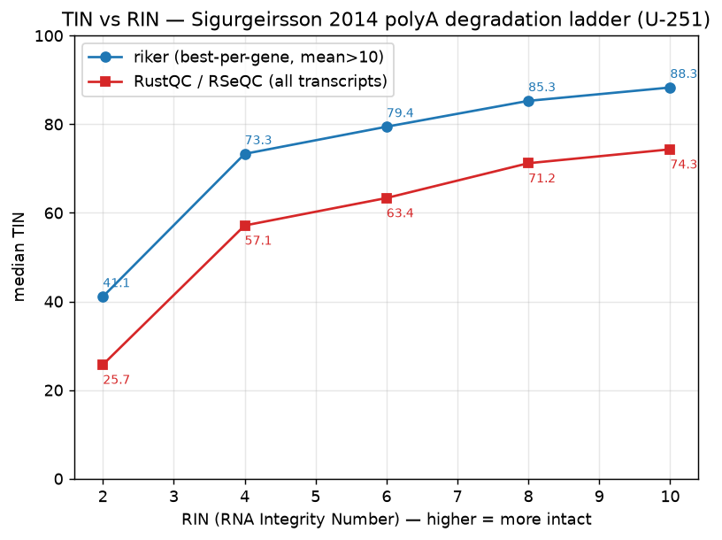
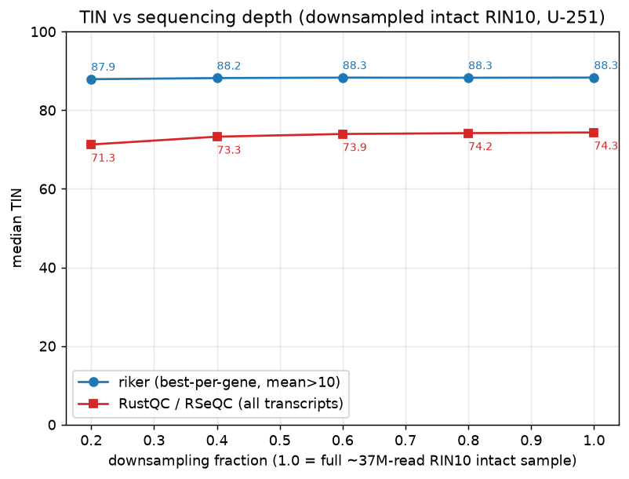

# Transcript Integrity (TIN) in riker

riker's `rna` command reports a **Transcript Integrity Number (TIN)** — a per-transcript,
coverage-uniformity score (0–100) that summarises RNA degradation, analogous to the Bioanalyzer
RIN but computed directly from aligned reads. The metric was introduced by RSeQC
([Wang et al. 2016](https://doi.org/10.1186/s12859-016-0922-z)); riker computes the same quantity
with a different transcript-selection strategy.

This document validates riker's TIN against the RSeQC implementation (as reimplemented by
[RustQC](https://github.com/seqeralabs/RustQC)) on real data, using two complementary experiments:

1. a **degradation ladder** — does TIN fall as RNA degrades?
2. a **depth-downsampling sweep** — does TIN stay put when only sequencing depth changes?

**TL;DR.** Both implementations work well. They report the *same shape* on a *different absolute
scale* — riker's TIN runs roughly 14–16 points higher because it scores a curated set of
well-covered transcripts rather than every expressed isoform. Both track degradation with very
similar sensitivity, and both are robust to sequencing depth, with riker holding noticeably steadier.
The practical takeaway is to read TIN on each tool's own scale and compare
like-for-like, not to expect the two tools to agree on the absolute number.

## What TIN measures

For a transcript with per-base coverage `cᵢ` over its `n` exonic positions:

```
TIN = 100 · e^H / n,   H = −Σ pᵢ·ln pᵢ,   pᵢ = cᵢ / Σⱼ cⱼ
    = 100 · exp( −D_KL(coverage ‖ uniform) )
```

`e^H` is the perplexity of the coverage distribution (the effective number of evenly-covered
positions); dividing by `n` expresses "what fraction of the transcript is as evenly covered as if
it were uniform." TIN is therefore **scale-invariant** — it depends on the *shape* of coverage, not
its absolute depth. Perfectly even coverage gives 100; coverage collapsing toward one end (the
hallmark of degraded, fragmented RNA) drives it down.

### Where riker and RSeQC/RustQC differ

The formula is identical; the difference is **which transcripts are scored**:

| | riker | RSeQC / RustQC |
|---|---|---|
| transcripts scored | **one representative (highest-mean-coverage) transcript per gene** | **every** annotated transcript |
| expression gate | mean coverage > `--tin-min-coverage` (default 10) and length ≥ `--minimum-length` (default 500) | > `minCov` (default 10) **unique read-start positions** |
| positions used | the **full** transcript | a strided sample of ~100 positions |

riker scores fewer, better-covered transcripts (one per gene), so its median sits higher and tighter;
RSeQC scores the full isoform set, including many marginally-expressed transcripts whose sparser
coverage pulls the median down. This is a deliberate design choice, and the experiments below show
what it buys.

## Methods

### Data — a controlled RNA-degradation ladder

We use the degradation series from **Sigurgeirsson, Emanuelsson & Lundeberg (2014), "Sequencing
Degraded RNA Addressed by 3′ Tag Counting," _PLoS ONE_ 9(3):e91851**
([doi:10.1371/journal.pone.0091851](https://doi.org/10.1371/journal.pone.0091851)). Intact total RNA
from the human **U-251 MG** glioblastoma cell line (RIN 10) was chemically fragmented for varying
times to produce a graded series at **RIN 10 → 8 → 6 → 4 → 2**, each then **poly-A selected** and
prepared with the Illumina TruSeq kit. Because every level derives from the *same* RNA under the
*same* protocol, **degradation is the only variable**.

Project **SRA SRP023548 / BioProject PRJNA206428**; the five poly-A runs (paired-end, 2×101 bp),
downloaded as FASTQ from the [European Nucleotide Archive](https://www.ebi.ac.uk/ena/):

| RIN | run accession | library | mapped reads |
|---|---|---|---|
| 10 | [SRR873822](https://www.ebi.ac.uk/ena/browser/view/SRR873822) | `RIN10A_polyA` | 64.6 M |
| 8 | [SRR879800](https://www.ebi.ac.uk/ena/browser/view/SRR879800) | `RIN8C_polyA` | 45.0 M |
| 6 | [SRR880232](https://www.ebi.ac.uk/ena/browser/view/SRR880232) | `RIN6B_polyA` | 40.3 M |
| 4 | [SRR881451](https://www.ebi.ac.uk/ena/browser/view/SRR881451) | `RIN4A_polyA` | 51.6 M |
| 2 | [SRR881985](https://www.ebi.ac.uk/ena/browser/view/SRR881985) | `RIN2A_polyA` | 36.0 M |

(Note that depth is *not* matched across the ladder — it ranges from ~36 M to ~65 M reads — which is
precisely why Experiment 2 is needed to rule depth out as a driver of the Experiment 1 signal.)

### Reference and annotation

- **Genome:** GRCh38, the 1000 Genomes "no-alt" analysis set with decoy and HLA contigs —
  `GRCh38_full_analysis_set_plus_decoy_hla.fa` (chr-prefixed), from the
  [1000 Genomes GRCh38 reference](ftp://ftp.1000genomes.ebi.ac.uk/vol1/ftp/technical/reference/GRCh38_reference_genome/).
  The no-alt set avoids alt-contig multi-mapping; decoy/HLA improve specificity.
- **Annotation:** **GENCODE v50** (GRCh38), comprehensive `gencode.v50.annotation.gtf`, from
  [gencodegenes.org/human/release_50](https://www.gencodegenes.org/human/release_50.html)
  ([Frankish et al. 2019](https://doi.org/10.1093/nar/gky955)). The same model is used for the
  splice-junction index, for riker's gene model, and for RustQC.

### Alignment

Indexing and alignment were both done with **[rustar-aligner](https://github.com/scverse/rustar-aligner)
v0.2.0** — a faithful Rust reimplementation of STAR ([Dobin et al. 2013](https://doi.org/10.1093/bioinformatics/bts635),
~99.8% concordant) — so a single tool produces the genome index and the alignments, for a consistent
picture. The index was built from the FASTA + GENCODE v50 GTF above, and each sample aligned against it:

```bash
rustar-aligner --runMode genomeGenerate --genomeDir <index> \
  --genomeFastaFiles GRCh38_full_analysis_set_plus_decoy_hla.fa \
  --sjdbGTFfile gencode.v50.annotation.gtf --sjdbOverhang 100

rustar-aligner --runThreadN 8 --genomeDir <index> \
  --readFilesIn R1.fastq.gz R2.fastq.gz \
  --outSAMtype BAM Unsorted --outFileNamePrefix <sample>.
samtools fixmate -m -u <sample>.Aligned.out.bam - \
  | samtools sort -o <sample>.mc.bam -
samtools index <sample>.mc.bam
```

(`samtools 1.22.1`; `fixmate -m` adds the `MC`/`ms` tags so transcript-space insert size and
mate-aware metrics work.)

### QC tools

- **riker** `0.4.0 pre-release` (`riker rna -i <bam> -o <prefix> --gene-model gencode.v50.annotation.gtf.gz`); TIN taken
  from `median_tin` in `<prefix>.rna-metrics.txt`.
- **RustQC** `0.2.1` (a reimplementation of RSeQC's `tin.py`), run on the same BAM with the same
  GENCODE v50 GTF; median TIN taken from `rseqc/tin/*.summary.txt`.

Both tools ran on the identical `.mc.bam` files with the identical annotation, so the only
difference is the TIN implementation.

## Experiment 1 — Does TIN track degradation?



| RIN | riker median TIN | RustQC median TIN | riker `median_cv_coverage` |
|---|---|---|---|
| 10 (intact) | 88.3 | 74.3 | 0.46 |
| 8 | 85.3 | 71.2 | 0.47 |
| 6 | 79.4 | 63.4 | 0.51 |
| 4 | 73.3 | 57.1 | 0.55 |
| 2 (severe) | 41.1 | 25.7 | 0.89 |

Both implementations fall **monotonically** as the RNA degrades, in near-lockstep, with a steep
drop at the most-degraded RIN 2 level. riker spans 88.3 → 41.1 (a 53% decrease); RustQC spans
74.3 → 25.7 (a 65% decrease). riker's `median_cv_coverage` (coefficient of variation of per-base
coverage, an independent uniformity statistic) rises monotonically from 0.46 to 0.89 over the same
series, corroborating the TIN trend from a second angle. Since the only thing changing across these
samples is degradation, this establishes that **both TINs are genuine degradation detectors**.

## Experiment 2 — Is TIN robust to sequencing depth?

A good degradation metric should respond to degradation and *not* to mere coverage depth. We took the
intact RIN 10 sample and downsampled it to 80/60/40/20% with `samtools view -s SEED.FRAC`, using a
**distinct seed per fraction so each is an independent random draw** (not a nested subset), then
re-ran both tools.



| fraction | reads | riker median TIN | RustQC median TIN |
|---|---|---|---|
| 1.0 | 64.6 M | 88.3 | 74.3 |
| 0.8 | 51.7 M | 88.3 | 74.2 |
| 0.6 | 38.8 M | 88.3 | 73.9 |
| 0.4 | 25.9 M | 88.2 | 73.3 |
| 0.2 | 12.9 M | 87.9 | 71.3 |

Both are robust — neither mistakes lower depth for degradation. riker moves **0.4 points (0.5%)**
across a 5× depth reduction; RustQC moves **3.1 points (4.1%)**. So both are dependable across the
~13–65 M read range, with riker holding noticeably steadier. (This also confirms that the varying
depths of the Experiment 1 ladder, 36–65 M reads, are not what produced its TIN trend.)

## Putting it together

| | degradation response (RIN 10→2) | depth response (5× downsample) | ratio |
|---|---|---|---|
| **riker** | 88 → 41 (−53%) | 88 → 88 (−0.5%) | ~115 : 1 |
| **RustQC / RSeQC** | 74 → 26 (−65%) | 74 → 71 (−4.1%) | ~16 : 1 |

Both tools are similarly sensitive to real degradation, and both are robust to depth. riker's
curated, best-per-gene transcript set makes it markedly more depth-stable — a favourable
signal-to-artifact balance — while RSeQC's all-transcript approach spans a slightly wider absolute
range but is more depth-sensitive; it works perfectly well as a relative indicator. Neither is "right"
or "wrong"; they answer the same question with a different transcript population.

## Practical guidance

- **TIN is a relative, within-tool indicator.** Compare TIN across samples processed *the same way*
  (same tool, same annotation, same gating). ~88 (riker) / ~74 (RSeQC) indicates intact RNA;
  falling values indicate degradation.
- **Don't compare absolute TIN across tools.** riker and RSeQC report on a similar shape but a
  different scale (riker ~14–16 points higher by construction). A "riker TIN of 80" and an "RSeQC
  TIN of 80" are not the same thing.
- riker's gate is tunable via `--tin-min-coverage` and `--minimum-length` if you want to widen or
  narrow the scored transcript set.
